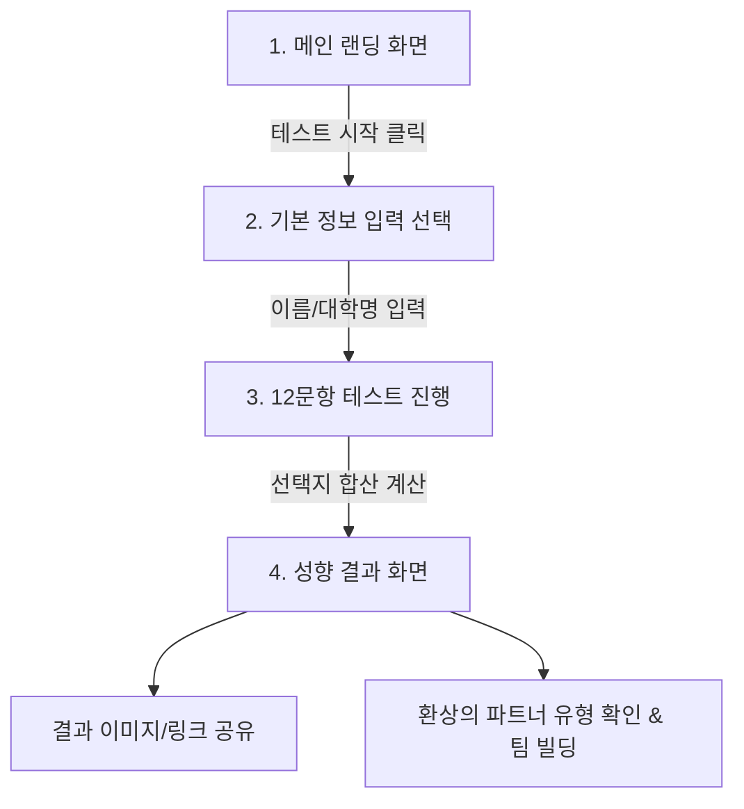

# 🚀 대학생 창업 성향 테스트 웹사이트 PRD (제품 요구사항 정의서)

---

## 1. 프로젝트 개요 (Overview)

### 1.1 프로젝트명
- **창업 성향 테스트 (Startup Type Test for University Students)**

### 1.2 배경 및 목적
- **배경**: 대학생 창업 캠프 참가자들은 자신의 강점과 팀 내 역할을 명확히 인지하지 못한 상태에서 팀을 구성하는 경우가 많음.
- **목적**: 
  1. 참가자가 재미있고 가벼운 질문을 통해 자신의 **창업가적 성향과 강점**을 파악하도록 도움.
  2. 테스트 결과를 바탕으로 캠프 내 **효율적인 팀 빌딩(서로 다른 성향의 팀원 조합)**을 촉진함.
  3. 초보자도 직관적으로 이해할 수 있는 쉬운 어조와 비주얼 중심 인터페이스 제공.

### 1.3 타겟 유저
- **주요 사용자**: 창업 캠프에 참여하는 대학생 및 청년 창업가 (10~20대 후반)
- **부사용자**: 창업 캠프 운영진 및 멘토 (참가자 성향 분포 확인 및 팀 빌딩 지도용)

---

## 2. 사용자 여정 (User Journey) 및 화면 구성

---

## 3. 주요 기능 명세 (Detailed Requirements)

### 3.1 메인 랜딩 화면 (Home)
- **헤드카피**: "나는 창업 팀에서 어떤 역할을 맡아야 할까? 나의 창업 성향 알아보기"
- **기능**:
  - [시작하기] 버튼
  - 테스트 소요 시간 안내 (예: "약 3분 소요 / 12문항")
  - (선택 사항) 참가자 이름/소속 대학 입력 폼 (캠프 현장 결과 제출용, 미입력 시 '익명' 진행)

### 3.2 테스트 진행 화면 (Test Flow)
- **질문 방식**: 창업 상황을 가정해 실제 일어날 법한 12가지 딜레마/선택 질문 제시
- **인터페이스**:
  - 진행도 바(Progress Bar): 현재 질문 번호 표시 (예: 3 / 12)
  - 보기 선택지: 카드 형태의 2~4가지 선택 버튼 (클릭 시 다음 질문으로 자동 이동)
  - 뒤로가기 버튼: 이전 답변 수정 가능

### 3.3 성향 결과 화면 (Result Page)
- **성향 캐릭터 & 타이틀**: 6가지 주요 성향 중 가장 높은 점수의 유형 출력
- **상세 구성**:
  1. **유형 별명 & 캐릭터 일러스트** (예: "불꽃 실행력의 액션파")
  2. **핵심 한 줄 요약** (예: "아이디어가 나오면 망설이지 않고 행동으로 옮기는 리더")
  3. **강점 & 주의할 점** (카드 형태의 유용한 피드백)
  4. **팀 내 추천 역할** (예: PM, 서비스 기획자, 개발자, 마케터 등)
  5. **🤝 환상의 파트너 (보완형 궁합)**: 나와 가장 잘 맞는 성향 유형 안내 (팀 빌딩 참고용)
  6. **공유 및 저장 기능**:
     - 결과 페이지 링크 복사 버튼
     - 결과 이미지 다운로드 / 저장 버튼
     - 카카오톡 / SNS 공유 기능

### 3.4 캠프 운영진 리포트 기능 (Option/Admin)
- 캠프 전체 참가자의 성향 비율 통계 차트 (예: 아이디어형 30%, 실행형 25% 등)
- 엑셀/CSV 데이터 다운로드 (참가자 이름 + 성향 결과)

---

## 4. 6가지 창업 성향 유형 정의

| 유형명 | 영어 칭호 | 핵심 특징 | 추천 역할 | 환상의 짝꿍 |
| :--- | :--- | :--- | :--- | :--- |
| **💡 아이디어형** | Visionary | 남들이 생각하지 못한 참신한 문제 의식과 아이디어를 냄 | 서비스 기획, CPO | 📊 분석형 |
| **🛠️ 제작형** | Maker | 아이디어를 직접 눈에 보이는 시제품(MVP)/코드/디자인으로 구현함 | 개발, 디자이너, CTO | 💡 아이디어형 |
| **🎯 전략형** | Strategist | 시장 가능성, 비즈니스 모델(BM), 수익 구조와 방향성을 설계함 | 대표(CEO), 전략 기획 | ⚡ 실행형 |
| **🤝 협업형** | Communicator | 팀원 간 소통을 매끄럽게 하고 외주/파트너십/피칭을 주도함 | 마케팅, 영업, CMO | 🎯 전략형 |
| **📊 분석형** | Analyst | 데이터, 고객 반응, 팩트에 기반하여 위험 요소를 점검하고 개선함 | 데이터 분석, CFO | 💡 아이디어형 |
| **⚡ 실행형** | Doer | 기획에 시간을 지체하지 않고 빠르게 고객 현장으로 나가 테스트함 | 현장 마케팅, COO | 🛠️ 제작형 |

---

## 5. 상황 질문 예시 (Test Questions Sample)

- **Q1. 팀 프로젝트 시작 시 당신의 첫 행동은?**
  - A. 멋지고 혁신적인 아이디어를 먼저 제안한다. (💡 아이디어형)
  - B. 빠른 시일 내에 개발/디자인할 수 있는 범위를 파악한다. (🛠️ 제작형)
  - C. 이 서비스가 실제로 돈이 될지, 시장성이 있는지 조사한다. (🎯 전략형)
  - D. 팀원들의 역할 분담과 분위기 개선부터 챙긴다. (🤝 협업형)

- **Q2. 아이디어가 막혔을 때 해결 방법은?**
  - A. 무작정 사람들을 만나 인터뷰하고 행동해 본다. (⚡ 실행형)
  - B. 기존 유사 서비스의 데이터와 통계를 철저히 분석한다. (📊 분석형)

---

## 6. 비기능 요구사항 (Technical & Design Requirements)

1. **모바일 퍼스트 반응형 웹**:
   - 캠프 현장에서 참가자들이 **스마트폰**으로 빠르게 접속하여 테스트하므로 Mobile UX 최우선 설계.
2. **빠른 로딩 속도 & 노 가입(No Sign-up)**:
   - 복잡한 회원가입 절차 없이 3초 이내 빠르게 시작 가능.
3. **디자인 톤앤매너**:
   - Z세대 대학생 취향에 부합하는 트렌디하고 비비드한 컬러 팔레트 적용.
   - 가독성이 뛰어난 둥근 형태의 폰트 및 모던 카드 레이아웃.

---

## 7. 구현 단계 (Roadmap)

1. **1단계 (기획)**: 12가지 상황 질문 및 성향 가산점 로직 확정
2. **2단계 (디자인)**: 메인, 질문, 결과 카드 UI/UX 디자인
3. **3단계 (개발)**: HTML/CSS/JavaScript 프론트엔드 반응형 웹 구현
4. **4단계 (테스트 & 배포)**: 캠프 현장 시범 운용 및 Vercel/Netlify 배포
